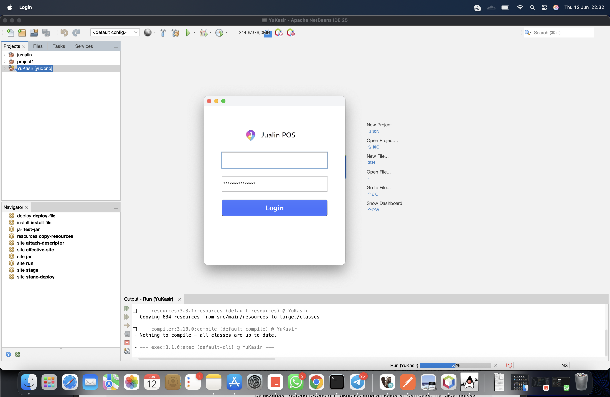
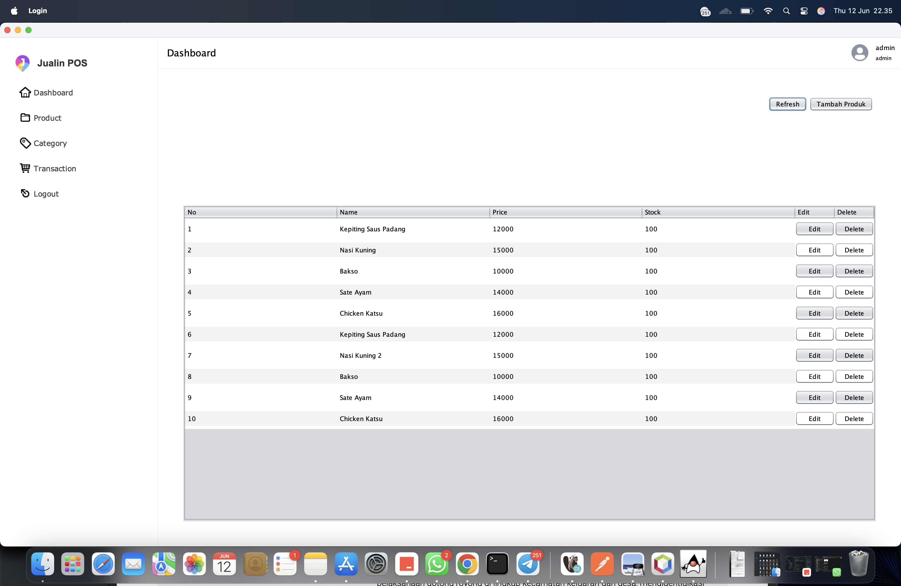
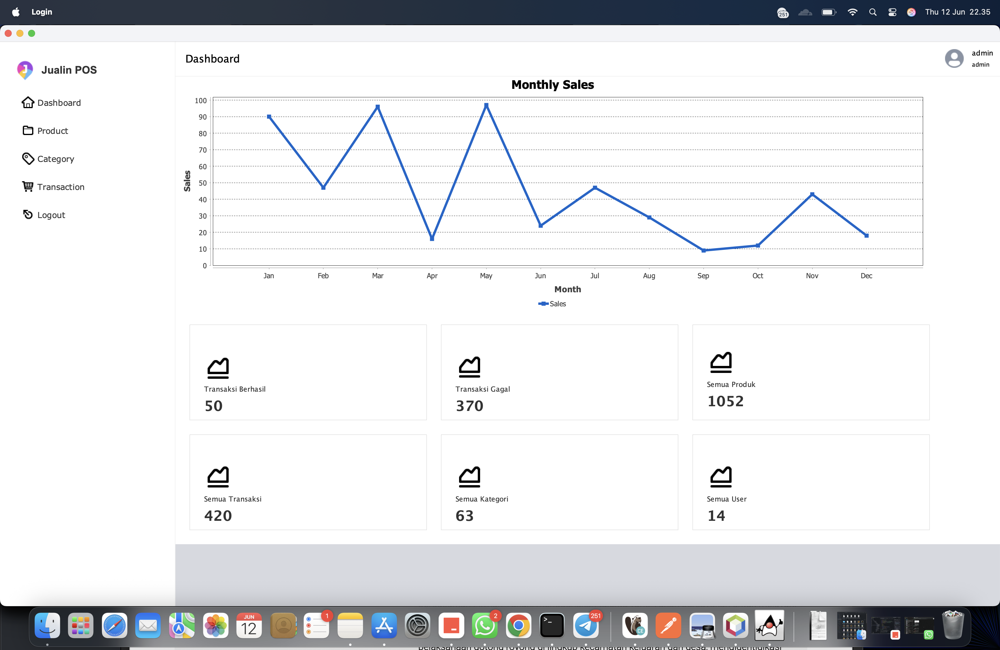
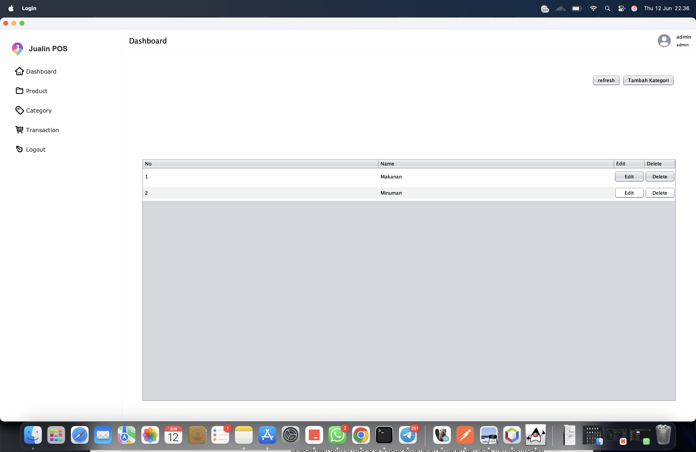
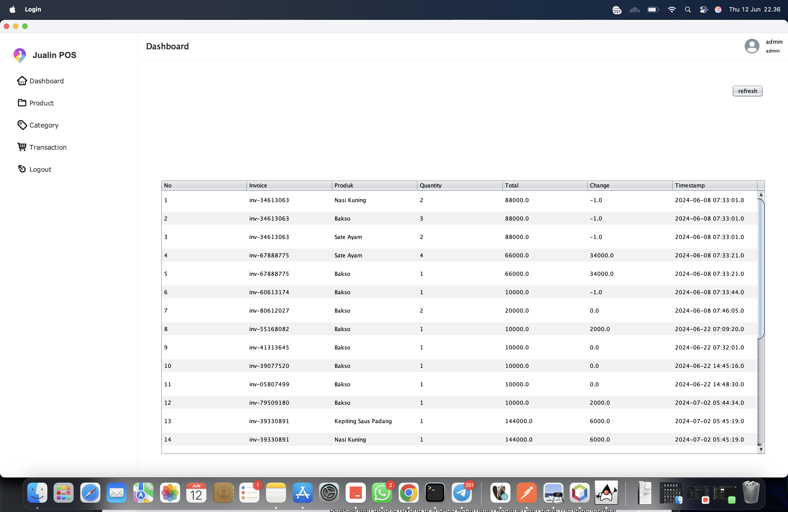
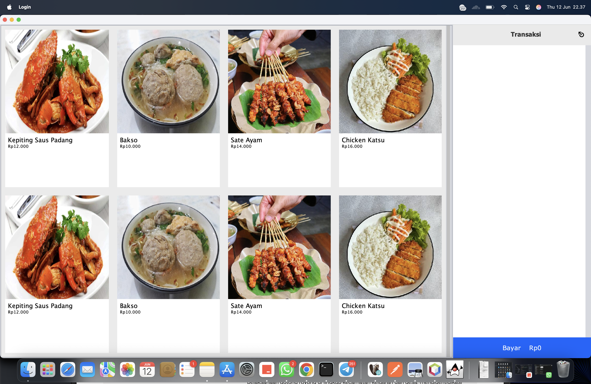
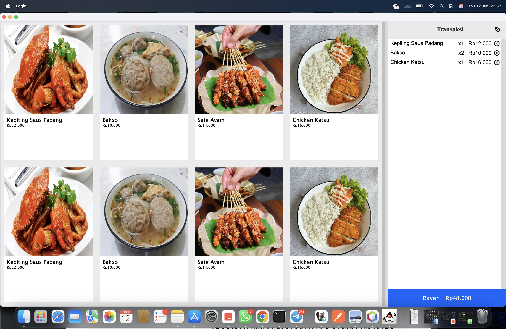
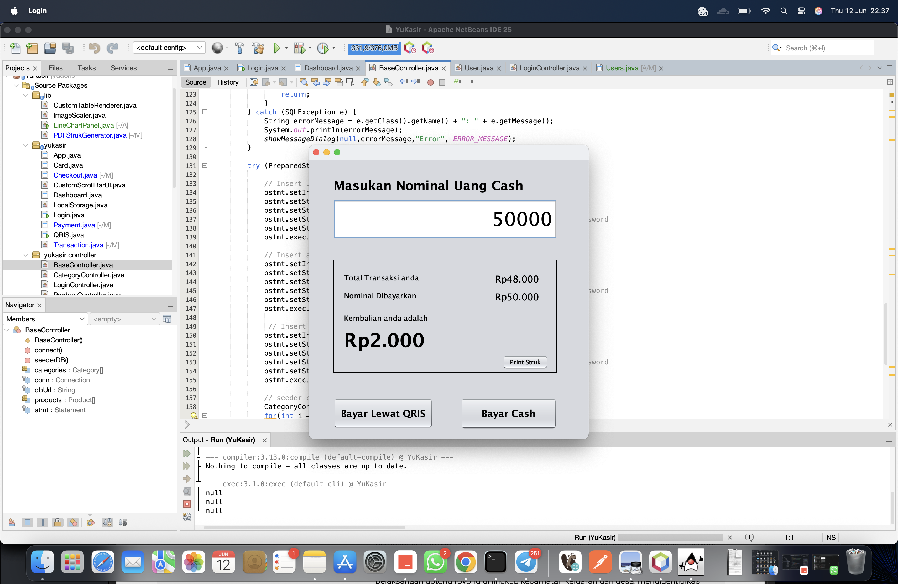

# YuKasir
Aplikasi desktop kasir buatan saya dari java swing netbeans

---

# 💻 Yuukasir - Aplikasi Kasir Desktop Java

**Yuukasir** adalah aplikasi kasir sederhana berbasis desktop yang dibuat dengan **Java Swing** dan **SQLite**. Cocok buat UMKM, toko retail kecil, atau kamu yang lagi belajar bikin aplikasi POS (Point of Sale) sendiri.

Proyek ini bisa langsung kamu buka di **NetBeans**.
Buat yang belum install NetBeans atau Java, banyak banget tutorialnya di Google kok hehe 😄

---

## ✨ Fitur Utama

* ✅ **Manajemen Produk**
  Tambah, ubah, hapus produk sesuai kebutuhan tokomu.

* 📂 **Kategori Produk**
  Kelompokkan produk berdasarkan kategori biar makin rapi.

* 🧾 **Transaksi Penjualan**
  Proses pembelian produk secara real-time.

* 👥 **Multi Role User**

  * Admin
  * Manajer
  * Kasir

* 📦 **Daftar Produk**
  Lihat semua produk yang tersedia dengan cepat.

* 💸 **Pembayaran**

  * Tunai (Cash)
  * Online (QRIS - *demo only*)

---

## ⚙️ Teknologi yang Digunakan

* Java Swing (GUI)
* SQLite (Database lokal)
* NetBeans (IDE yang direkomendasikan)

---

## 🔧 Custom Feature?

Punya ide custom fitur atau butuh modifikasi buat bisnis kamu?
Yuk ngobrol langsung aja ke email:

📩 **[yudonoputro@gmail.com](mailto:yudonoputro@gmail.com)**

---

## 📥 Cara Menjalankan

1. Buka project ini di **NetBeans**.
2. Install dependency maven
3. Langsung jalankan project di netbeans
4. Database otomatis dibuat saat pertama kali dijalankan.

---

## 🙌 Kontribusi

Feel free untuk fork, kasih saran, atau pull request!
Proyek ini open-source dan bebas dimodifikasi selama mencantumkan kredit.

---

informasi login:

| name    | password          | role  |
|---------|-------------------|-------|
| user    | user@gmail.com    | 12345 |
| admin   | admin@gmail.com   | 12345 |
| manager | manager@gmail.com | 12345 |

---

#screenshot:

